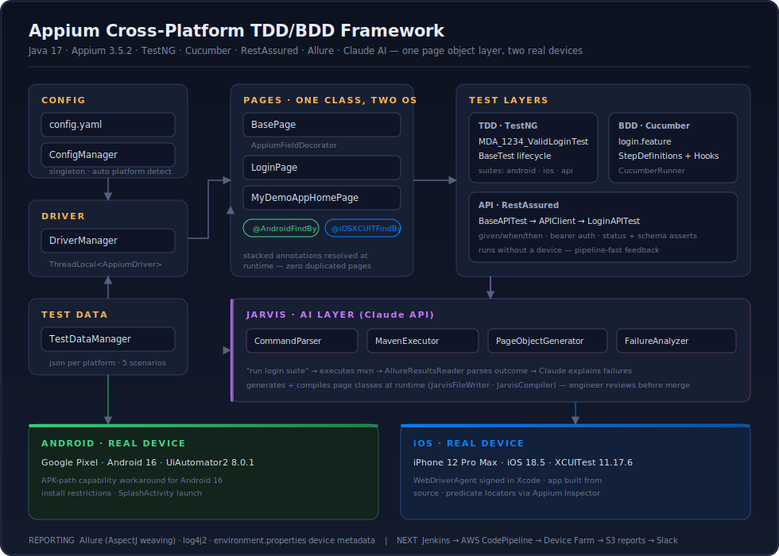

# Appium Cross-Platform Automation Framework

TDD + BDD mobile test framework in Java, running against **real devices** — a Pixel on Android 16 and an iPhone 12 Pro Max on iOS 18.5 — with a single page-object layer serving both platforms, a RestAssured API layer, Allure reporting, and an experimental AI assistant ("Jarvis") wired to the Claude API that can run suites, generate page classes, and explain failures.

Built as a from-scratch exercise in doing mobile automation the way I'd want to inherit it: config-driven, thread-safe, and honest about the ugly parts of real-device testing.



## What's in here

| Layer | What it does |
|---|---|
| `config/` | `config.yaml` + a singleton `ConfigManager` that auto-detects the connected platform via `adb devices` / `idevice_id -l`. Override anything at runtime with `-Dplatform=ios`. |
| `drivers/` | `DriverManager` holding `ThreadLocal<AppiumDriver>` so parallel suites don't stomp on each other. |
| `base/` | `BasePage` (AppiumFieldDecorator, waits) and `BaseTest` (TestNG lifecycle). |
| `pagescommon/` | One page class per screen with **stacked** `@AndroidFindBy` + `@iOSXCUITFindBy` annotations. The decorator picks the right one at runtime. No duplicated page code between platforms. |
| `stepdefinations/`* | Cucumber glue for `login.feature` — BDD sits on top of the same page objects the TDD tests use. |
| `api/` | RestAssured layer: `BaseAPITest` → `APIClient` → tests. Runs with no device attached, which keeps pipeline feedback fast. |
| `utils/` | `TestDataManager` reading per-platform JSON (5 login scenarios each). |
| `jarvis/` + `ai/` | The fun part. Text commands like *"run the login suite"* get parsed, executed through Maven, and the Allure results are read back and summarized. `PageObjectGenerator` asks Claude to write a page class, then `JarvisCompiler` compiles it in place. Generated code gets reviewed by a human before it's trusted — the AI proposes, I dispose. |

\* Yes, the package is spelled `stepdefinations`. It matched the folder before I noticed, and Cucumber's glue path doesn't care about my dignity. Renaming is on the list.

## Stack

Java 17 · Maven 3.9 · Appium 3.5.2 (server) · appium-java-client 8.6.0 · Selenium 4.18.1 · TestNG · Cucumber · RestAssured · Allure · log4j2 · uiautomator2 8.0.1 · xcuitest 11.17.6

## Things that fought back (and how they lost)

These cost real hours, so they're documented here for the next person:

- **Appium 3.x refuses to run on Node 18/19** — you get `ERR_REQUIRE_ESM` and no useful hint. Node 20 via NVM fixed it. Pin it and move on.
- **Android 16 blocks launching the app by package identifier.** The workaround that worked: install via the `appium:app` APK-path capability instead of pointing at the installed identifier. Also, the correct launch activity is `SplashActivity` — using MainActivity kills the session instantly.
- **Allure steps silently missing from reports.** The AspectJ `-javaagent` must live on the surefire `argLine` inside the `<configuration>` block. Putting it in `systemPropertyVariables` does nothing, quietly. This one took embarrassingly long.
- **iOS real device setup** is its own small odyssey: WebDriverAgent re-signed in Xcode with a free Apple ID, the demo app built from source so the bundle ID matches, `xcode-select` pointed at the right toolchain. The Login button wouldn't respond to anything except an iOS predicate: `name == 'Login' AND type == 'XCUIElementTypeButton'`.
- **Case sensitivity in config getters**: `bundleId` vs `bundleID` fails silently and wastes an afternoon.

## Running it

```bash
# Appium server (Node 20 required)
appium

# Android suite (Pixel connected via adb)
mvn test -DsuiteXmlFile=testng-android.xml

# iOS suite (device trusted, WDA signed)
mvn test -DsuiteXmlFile=testng-ios.xml

# API suite — no device needed
mvn test -DsuiteXmlFile=testing-api.xml

# BDD
mvn test -DsuiteXmlFile=testng-cucumber.xml

# Reports
allure serve allure-results
```

Device UDIDs, bundle IDs, and capabilities live in `src/main/resources/config.yaml`. Credentials never go in the repo — BrowserStack keys and the Claude API key are read from environment variables (`CLAUDE_API_KEY`).

## Jarvis in one example

```
> run login suite
[MavenExecutor] mvn test -DsuiteXmlFile=testng-android.xml
[AllureResultsReader] 5 tests, 4 passed, 1 failed
[FailureAnalyzer → Claude] test_invalid_login failed on locator
  'test-ERROR' — element renders ~400ms after tap on slower
  devices. Suggest explicit wait on visibility instead of presence.
```

## Roadmap

- **CI/CD**: Jenkinsfile + AWS CodePipeline → CodeBuild → Device Farm, nightly cron via CloudWatch, Allure to S3, Slack notifications
- Jarvis voice mode (speech in/out around the existing command core)
- Package rename you-know-where

---

Questions or want a walkthrough? Open an issue — happy to talk mobile automation.
